# Compose Composer Architecture

This document provides visual representations of the compose_composer architecture, including module dependencies, data flow, and processing pipelines.

## Module Dependency Graph

This diagram shows how the modules depend on each other. Lower-level modules (utils, profiles) have no dependencies, while higher-level modules depend on them through dependency injection.

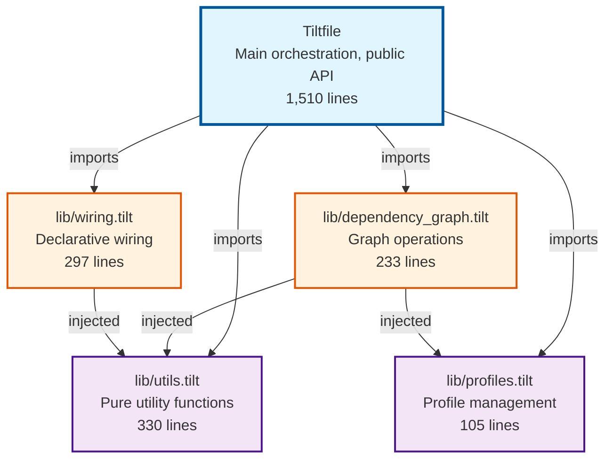

**Legend**:
- **Blue** (Tiltfile): Main orchestration and public API
- **Purple** (Utils, Profiles): Leaf modules with no dependencies
- **Orange** (DepGraph, Wiring): Mid-level modules with injected dependencies

**Key Insight**: Dependencies flow in one direction (bottom-up). No circular dependencies.

## Data Flow Pipeline

This diagram shows how data flows through the system from CLI arguments to running Docker Compose containers.

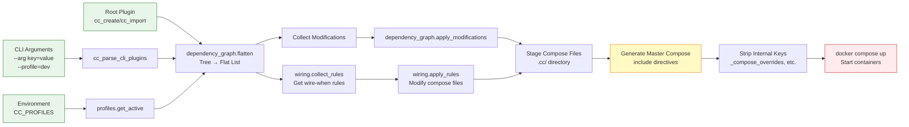

**Processing Stages**:
1. **Input** (green): CLI args, environment vars, root plugin
2. **Graph Processing** (center): Flatten, collect rules/mods, apply transformations
3. **Output Generation** (yellow): Generate master compose file
4. **Execution** (red): Start Docker Compose

## Orchestration Workflow

This diagram shows the detailed workflow inside `cc_generate_master_compose()`.

```mermaid
flowchart TD
    Start([cc_generate_master_compose]) --> Input{Input Type?}

    Input -->|Plugin Struct| ConvertStruct[dependency_graph.struct_to_dict]
    Input -->|Dict| UseDict[Use as-is]

    ConvertStruct --> ParseCLI
    UseDict --> ParseCLI

    ParseCLI[Parse CLI plugins<br/>cc_parse_cli_plugins] --> GetActive[Get active profiles<br/>profiles.get_active]

    GetActive --> Flatten[Flatten tree<br/>dependency_graph.flatten]

    Flatten --> EarlyWire{Early wiring?}

    EarlyWire -->|Yes| CollectEarly[Collect early wire-when rules<br/>wiring.collect_rules<br/>with cc context]
    EarlyWire -->|No| CollectMods

    CollectEarly --> CollectMods[Collect modifications<br/>from all plugins]

    CollectMods --> ApplyMods[Apply modifications<br/>dependency_graph.apply_modifications]

    ApplyMods --> CollectRules[Collect wire-when rules<br/>wiring.collect_rules]

    CollectRules --> ProcessLoop[For each dependency]

    ProcessLoop --> LoadCompose[Load compose file<br/>read_yaml]
    LoadCompose --> CheckProfile{Profile match?}

    CheckProfile -->|Yes| ApplyRules[Apply wire-when rules<br/>wiring.apply_rules]
    CheckProfile -->|No| Skip[Skip dependency]

    ApplyRules --> Stage[Stage modified compose<br/>.cc/dep-name.yaml]

    Stage --> AddInclude[Add to master includes]
    AddInclude --> More{More deps?}

    More -->|Yes| ProcessLoop
    More -->|No| Generate[Generate master compose]

    Skip --> More

    Generate --> StripInternal[Strip internal keys<br/>_compose_overrides, etc.]
    StripInternal --> Write[Write master file]
    Write --> End([Return master_compose])

    style Start fill:#e8f5e9,stroke:#2e7d32,stroke-width:3px
    style End fill:#e8f5e9,stroke:#2e7d32,stroke-width:3px
    style Flatten fill:#fff3e0,stroke:#e65100,stroke-width:2px
    style ApplyRules fill:#fff3e0,stroke:#e65100,stroke-width:2px
    style Generate fill:#fff9c4,stroke:#f57f17,stroke-width:2px
```

## Module Responsibilities

This diagram shows what each module is responsible for.

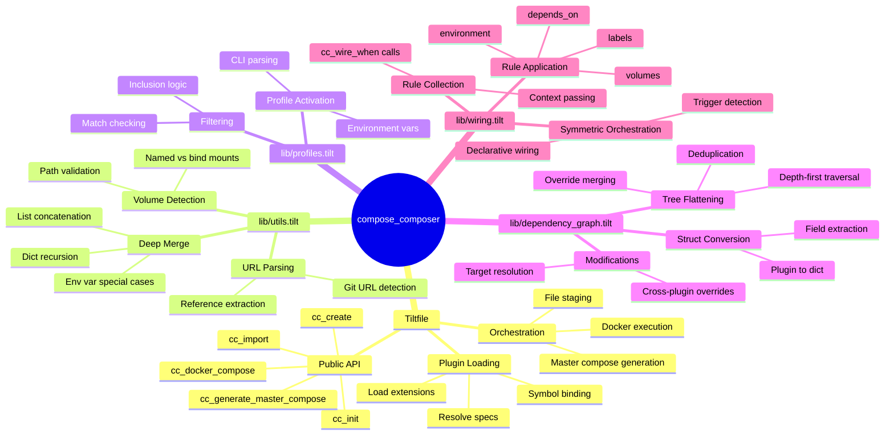

## Design Patterns

### Struct Namespace Pattern

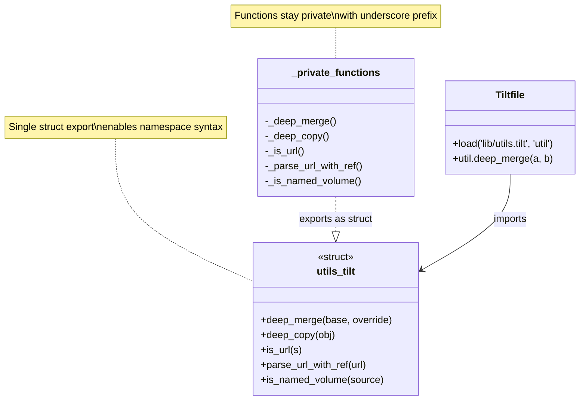

### Dependency Injection Pattern

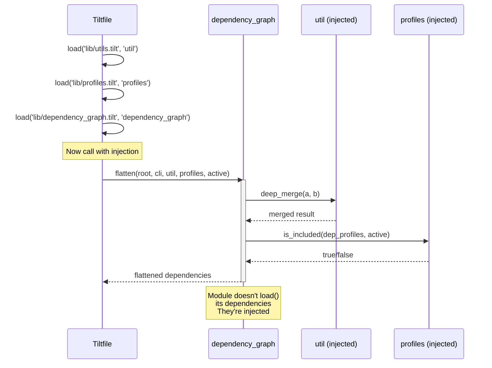

## Wire-When System

This diagram shows how the declarative wiring system enables symmetric orchestration.

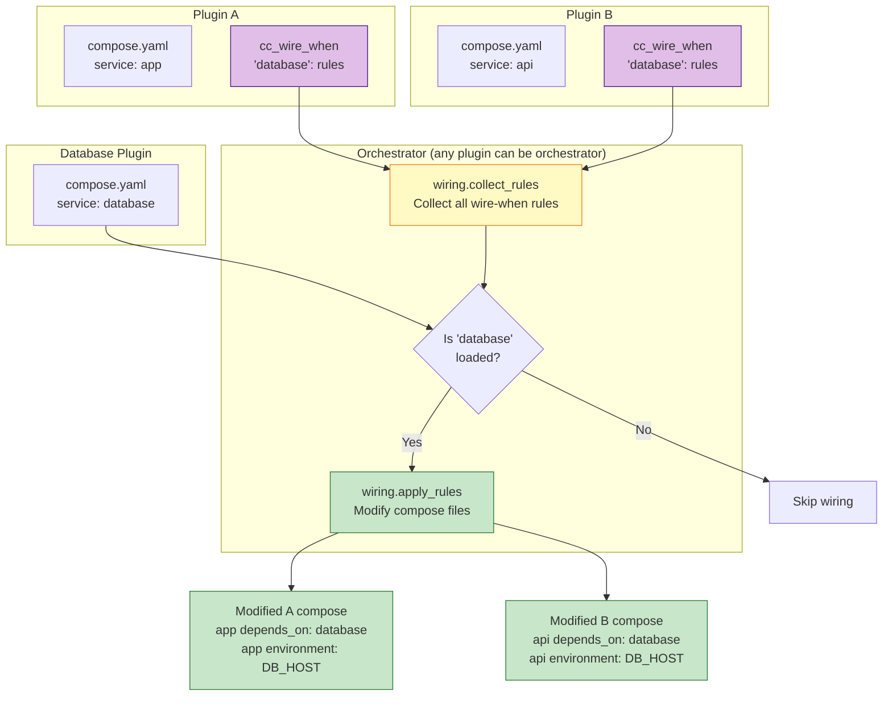

**Key Principle**: Plugins declare "if X is loaded, wire me to X" rather than imperatively importing X. This enables any plugin to be the orchestrator - the result is the same regardless of who starts the composition.

## Profile Filtering Flow

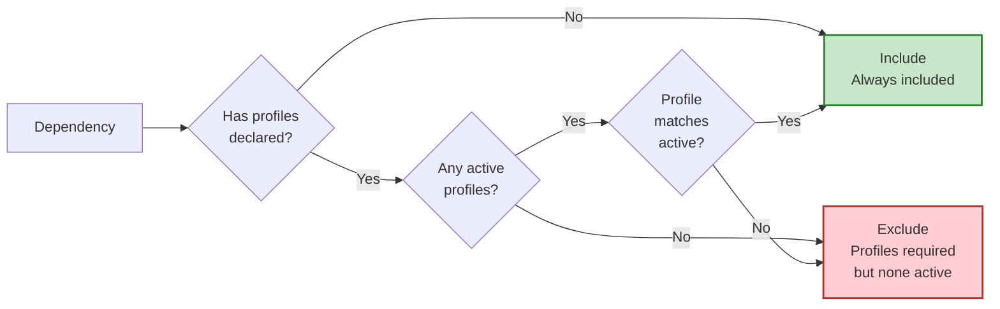

**Examples**:
- `profiles: []` → Always included
- `profiles: ['dev']` + active `['dev']` → Included (match)
- `profiles: ['prod']` + active `['dev']` → Excluded (no match)
- `profiles: ['dev']` + active `[]` → Excluded (profiles required but none active)

## Dependency Graph Flattening

This diagram shows how a dependency tree is flattened into a list with deduplication.

```mermaid
graph TD
    subgraph "Input: Dependency Tree"
        Root[root/app]
        Root --> PluginA[plugin-a]
        Root --> PluginB[plugin-b]
        PluginA --> Common[common-lib]
        PluginB --> Common2[common-lib]
        PluginA --> DB[database]
    end

    subgraph "Depth-First Traversal"
        T1[1. Visit root] --> T2[2. Descend to plugin-a]
        T2 --> T3[3. Descend to common-lib]
        T3 --> T4[4. Add common-lib to result]
        T4 --> T5[5. Back to plugin-a]
        T5 --> T6[6. Descend to database]
        T6 --> T7[7. Add database to result]
        T7 --> T8[8. Back to plugin-a]
        T8 --> T9[9. Add plugin-a to result]
        T9 --> T10[10. Back to root]
        T10 --> T11[11. Descend to plugin-b]
        T11 --> T12[12. Try common-lib]
        T12 --> T13[13. Already seen - merge overrides]
        T13 --> T14[14. Back to plugin-b]
        T14 --> T15[15. Add plugin-b to result]
        T15 --> T16[16. Back to root]
        T16 --> T17[17. Add root to result]
    end

    subgraph "Output: Flat List (Dependency Order)"
        Out1[common-lib]
        Out2[database]
        Out3[plugin-a]
        Out4[plugin-b]
        Out5[root/app]

        Out1 --> Out2 --> Out3 --> Out4 --> Out5
    end

    style Root fill:#e1f5ff,stroke:#01579b,stroke-width:2px
    style Common fill:#ffcdd2,stroke:#c62828,stroke-width:2px
    style Common2 fill:#ffcdd2,stroke:#c62828,stroke-width:2px,stroke-dasharray: 5 5
    style Out1 fill:#c8e6c9,stroke:#2e7d32,stroke-width:2px
    style Out5 fill:#e1f5ff,stroke:#01579b,stroke-width:2px
```

**Key Features**:
- Depth-first traversal ensures dependencies appear before dependents
- Deduplication: Each plugin appears only once (first occurrence wins)
- Compose_overrides from duplicate occurrences are merged into first occurrence
- Result list is in dependency order (safe for Docker Compose startup)

## Test Architecture

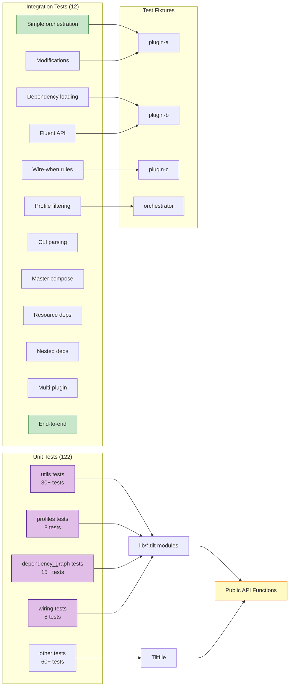

**Test Strategy**:
- **Unit tests** validate individual functions and modules
- **Integration tests** validate end-to-end workflows using fluent API
- **Test fixtures** provide realistic plugin examples
- **Test wrappers** in main Tiltfile maintain backward compatibility

## Refactoring Timeline

```mermaid
timeline
    title Compose Composer Refactoring Journey

    section Phase 1: Safety Net
        Added integration tests : 12 tests
        Created test fixtures : 4 plugins
        Validated coverage : 134 total tests

    section Phase 2: Utils
        Extracted lib/utils.tilt : 330 lines
        Introduced struct pattern : Namespace syntax
        Main file reduction : -340 lines

    section Phase 3: Profiles
        Extracted lib/profiles.tilt : 105 lines
        Profile filtering : CLI + env var
        Main file reduction : -50 lines

    section Phase 4: Graph
        Extracted lib/dependency_graph.tilt : 233 lines
        Dependency injection : Multi-module
        Test wrappers : Backward compat
        Main file reduction : -160 lines

    section Phase 5: Wiring
        Extracted lib/wiring.tilt : 297 lines
        Symmetric orchestration : Declarative rules
        Main file reduction : -210 lines

    section Documentation
        Updated CLAUDE.md : Architecture docs
        Created lib/README.md : Module docs
        Created REFACTORING_SUMMARY.md : Journey docs
        Created ARCHITECTURE.md : Visual diagrams
```

## Success Metrics

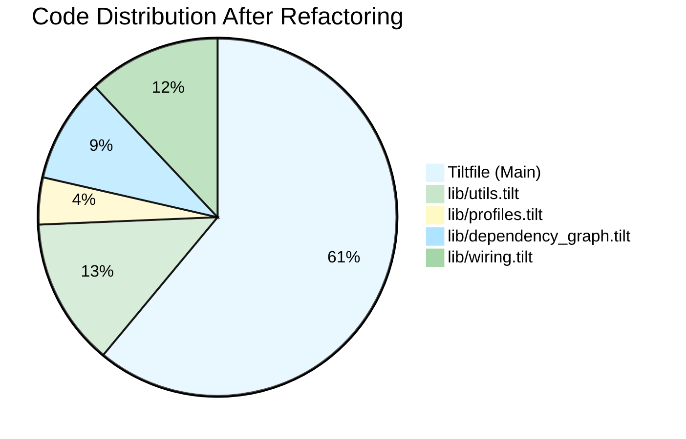

**Achievements**:
- ✅ **33% main file reduction** (2,270 → 1,510 lines)
- ✅ **100% test compatibility** (134/134 passing)
- ✅ **4 focused modules** created
- ✅ **Zero breaking changes** to public API
- ✅ **Clear design patterns** documented

---

**Legend for Diagrams**:
- 🟦 **Blue**: Main orchestration layer (Tiltfile)
- 🟪 **Purple**: Leaf modules (utils, profiles)
- 🟧 **Orange**: Mid-level modules (dependency_graph, wiring)
- 🟩 **Green**: Success/Include paths
- 🟥 **Red**: Failure/Exclude paths
- 🟨 **Yellow**: Generation/Output stages
